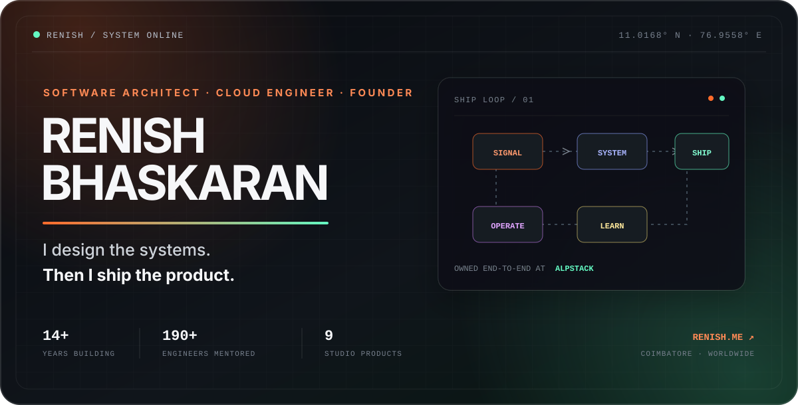
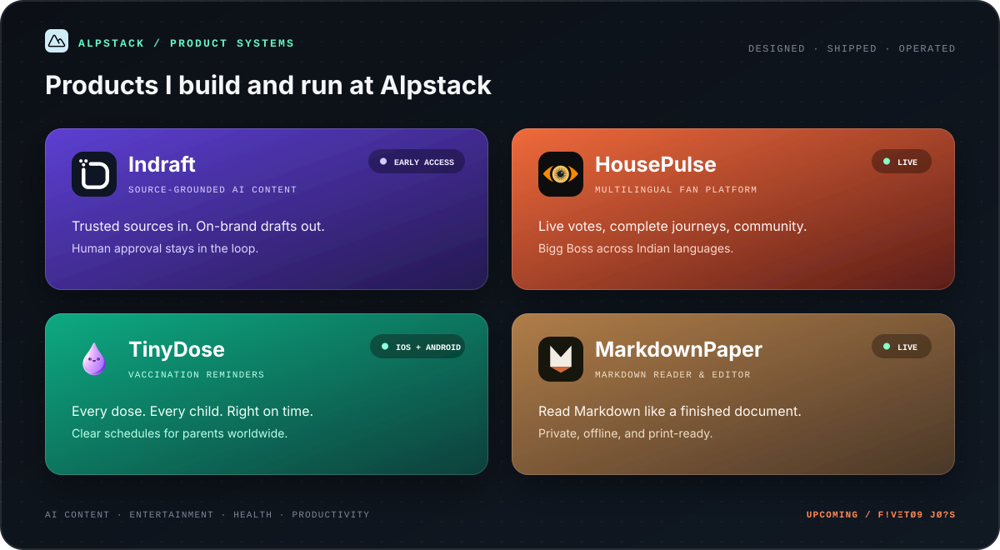
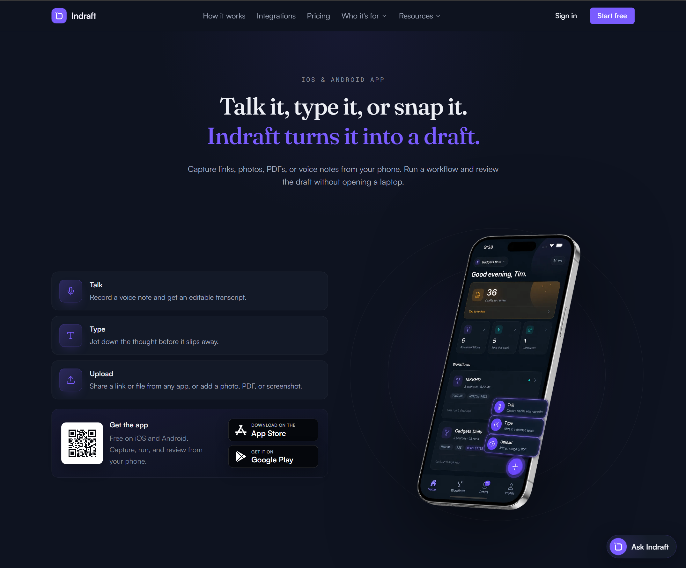

# Renish Bhaskaran

I’m **Renish B**, a software architect, cloud engineer, and founder from Coimbatore, India. I’ve been building software for 14+ years, from enterprise platforms and cloud infrastructure to web apps, mobile apps, and my own products at **[Alpstack](https://alpstack.com)**.

I enjoy working across the whole product, from the first technical decisions to deployment and support.

  
  
  
  

 

## Building now: Alpstack

**Alpstack is the company I started to build and run software products.** I work on the product decisions, design, development, infrastructure, release, and support. I continue to maintain each product after it launches.

### Selected products

<table>
<tr>
<td width="50%" valign="top">

 <strong>Indraft</strong> · Sources in. Reviewable drafts out.
</td>
<td width="50%" valign="top">

 <strong>Indraft Mobile</strong> · Capture, run, and review from your phone.
</td>
</tr>
<tr>
<td width="50%" valign="top">

 <strong>HousePulse</strong> · Live voting, contestant journeys, and community.
</td>
<td width="50%" valign="top">

 <strong>MarkdownPaper</strong> · A calmer way to read Markdown.
</td>
</tr>
</table>

- **[Indraft](https://indraft.pub)** · `early access`: AI content drafting based on trusted sources. It supports 8 source types and 23 destinations, and nothing is published without review.
- **Indraft Mobile** · `iOS + Android`: Capture ideas by voice, text, photo, file, or link, then review and approve Indraft workflows from your phone. [App Store](https://apps.apple.com/in/app/indraft-ai-content-writer/id6794631258) · [Google Play](https://play.google.com/store/apps/details?id=com.alpstack.indraft)
- **[HousePulse](https://housepulse.in)** · `live`: A multilingual Bigg Boss fan platform with live voting, contestant profiles, season archives, articles, and community features.
- **[TinyDose](https://alpstack.com/tinydose)** · `iOS + Android`: Vaccination schedules and reminders for parents. It supports India’s UIP and IAP schedules, the US CDC schedule, the UK NHS schedule, and others. [App Store](https://apps.apple.com/in/app/tinydose-baby-vaccine-tracker/id6762482872) · [Google Play](https://play.google.com/store/apps/details?id=com.alpstack.tinydose)
- **[MarkdownPaper](https://markdownpaper.app)** · `live`: A private Markdown reader and editor that turns local files or pasted Markdown into a typeset page with code, math, diagrams, and PDF export.

**Other live products:** [Triotask](https://alpstack.com/triotask) · **[View all products](https://alpstack.com/products)**

**Coming next:** `CЯ∆V?` · `F!VΞTØ9 JØ?S` · `HØUSΞØF∆P!S`

## What I work on

- **Cloud and platform engineering:** Kubernetes operators in Go, Kubernetes-as-a-Service, AWS infrastructure, autoscaling, messaging, observability, Terraform, and Argo.
- **Web and mobile products:** React, Next.js, React Native, APIs, databases, performance, accessibility, and SEO.
- **Engineering support:** architecture reviews, code reviews, project delivery, technical interviews, and mentoring. I’ve mentored more than 190 engineers through Springboard and CareerFoundry.
- **Running products:** research, design, development, launch, analytics, customer support, and regular improvements.

<strong>Experience</strong>

 

**2023 → now · Founder, Alpstack** 
Building and operating a portfolio of software products; consulting on architecture, cloud systems, engineering quality, and hiring.

**May 2020 → now · Software Development Mentor & Educator, Springboard** 
Mentored 90+ engineers one-to-one across full-stack development, AWS cloud, and Python with Django. This includes Amazon and Walmart upskilling cohorts, plus university partnerships with the University of Florida and the University of Michigan. Weekly sessions cover code review, pair programming, architecture, debugging, system design, APIs, CI/CD, databases, cloud deployment, and capstone approval.

**Jul 2020 → Feb 2026 · Software Engineering Mentor & Technical Instructor, CareerFoundry** 
Mentored around 100 engineers across full-stack development, AWS cloud, and Python with Django, including learners sponsored by Germany’s Federal Employment Agency. Led technical sessions, code reviews, pair programming, architecture discussions, debugging workshops, project reviews, and individual growth plans across distributed teams.

**2020 → 2023 · Kubernetes platform engineering** 
Built Kubernetes-as-a-Service systems with Go, Operator SDK, AWS, Argo CD, and Argo Workflows for a platform serving millions of users.

**2019 → 2020 · Full-stack engineering & architecture** 
Reworked cloud and database architecture, migrated a complex Meteor product, shipped mobile experiences, and built push infrastructure at scale.

**2014 → 2019 · Product engineering at Pearson / GlobalEnglish** 
Helped deliver award-winning learning products, performance improvements, migration programs, and GDPR readiness.

**2012 → 2014 · Enterprise engineering at Aon** 
Started with C#, ASP.NET, SQL Server, and the rigor of US retirement and health-benefits systems.

## Technology I use

| Layer | Tools I use in production |
|---|---|
| **Product** | TypeScript · JavaScript · React · Next.js · React Native · Node.js |
| **Platforms** | Go · Kubernetes · Docker · Argo CD · Argo Workflows · Terraform |
| **Cloud & data** | AWS · PostgreSQL · MongoDB · DynamoDB · SQS · Lambda |
| **Earlier foundations** | C# · ASP.NET · SQL Server · Python |

## Certifications

<table>
<tr>
<td width="20%" align="center" valign="top">

 <strong>Google Project Management</strong>
 Verified credential
</td>
<td width="20%" align="center" valign="top">

 <strong>Kubernetes Administrator</strong>
 Previously certified
</td>
<td width="20%" align="center" valign="top">

 <strong>AWS Solutions Architect</strong>
 Previously certified
</td>
<td width="20%" align="center" valign="top">

 <strong>Terraform Associate</strong>
 Previously certified
</td>
<td width="20%" align="center" valign="top">

 <strong>MCSA Web Applications</strong>
 Certified 2016
</td>
</tr>
</table>

## How I can help

I take on a small number of projects involving:

- software and cloud architecture
- full-stack product development
- architecture and code reviews
- technical interviewing
- developer mentoring
- fractional engineering leadership

If you need help with a product, architecture, or cloud systems, **[get in touch](https://renish.me/#contact)**.

---

[**renish.me**](https://renish.me) &nbsp;·&nbsp; [**Alpstack**](https://alpstack.com) &nbsp;·&nbsp; [**Writing**](https://renish.me/blog) &nbsp;·&nbsp; [**LinkedIn**](https://www.linkedin.com/in/renishb)

Coimbatore, India · available for remote work worldwide

